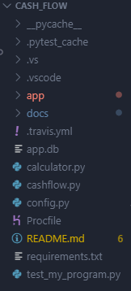
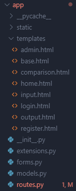
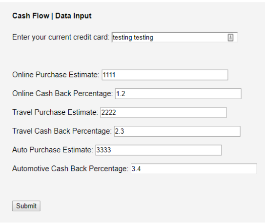
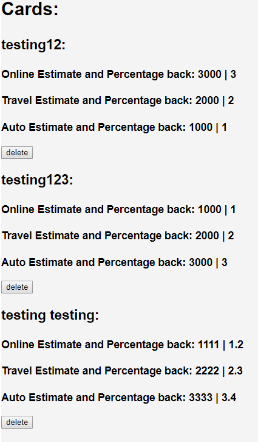
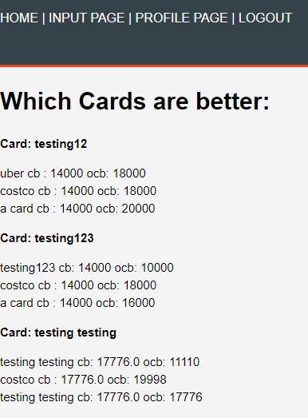

.. Cash Flow documentation master file, created by
   sphinx-quickstart on Fri Dec  6 01:46:51 2019.
   You can adapt this file completely to your liking, but it should at least
   contain the root `toctree` directive.

.. toctree::
   :maxdepth: 2
   :caption: Contents:

Cashflow-An app designed to help you
====================================

The purpose of cash flow is to make it easy for its user to make a broad range of comparisons between their current credit cards and other potential credit cards (such as the one offered by costco), and notify them if their card is better for them, or if the other card is.

Running the application
=======================

To run this application, you first need to clone the repository. Then, navigate
to the directory where it was cloned and open it in a terminal.

Then, after cloning the repository, ensure that yo uhave installed the required
packages by running the following command:

``pip install -U -r requirements.txt``

Then either of the following commands should work:

``flask run``

If the above command does not work, the following command can also be used (on
Linux):

``export FLASK_APP = cashflow``

``flask run``

https://cash-flo.herokuapp.com/ links to the heroku application for
this project (to verify that we deployed the application to heroku).

Verifying the Doc Files
=======================

After cloning the repository, the doc files will be located within the "Docs"
folder, and within a file explorer, right clicking the "index.html" file located
in

``./docs/build/html/index.html``

Travis-CI and Testing
=====================

This project (as indicated by the build state banner at the top of this readme)
has Travis-CI enabled. In order to check the status of the unit tests
clone the repository and within some sort of command prompt (cmd, powershell,
bash, etc.), navigate to the root directory of this application and type in

``pytest``
and the unit tests should run.

Verifying the features
======================

*********
Home page
*********

The functionality of this feature can be verified by launching the application.
Each page on the website should be able to connect to the home page through the
NAV bar.

*******
Nav Bar
*******

This feature exists on every single page. It automatically adjusts itself
depending on the page that the user is on, and it also adjusts itself if the user
is logged in or not. If the user is logged on, they'll only have the ability to
logout. If the user is not logged in, they'll be able to login or register.

*****
Login
*****

This feature can be tested by clicking on the "login" button on the NAV bar
or by pressing the "get started" button on the home page to view this page.
This page enables users to log in, and once logged in, they should be taken to
the input page where they can put their credit card name, and the information
associated with it. There is also a link on the login page that routes users to
the register page if they don't have an account.

********
Register
********

Similar to the Login feauture, this feature can be tested by clicking on the
"register" button on the NAV bar. If a user doesn't input data into one of the
fields or if they don't type in a correctly formatted email, it should prompt
them to try again. After they sign up, they should be redirected to the login
page, where they can sign in with their new username/password.

******
Logout
******

This feature appears on the NAV bar after a user logs in. By logging in, the
user should have the ability to logout, and they will be redirected to the home
page.

**********
Input Page
**********

The user is redirected here after they login. On this page they can input basic
information about their credit card, such as the amount of money they spend on
three overall categories, and how much cash back (percentage) they receive from
this. After they press the submit button, the user will be redirected to the
final output page.

*******************************
Output Page / Card Profile Page
*******************************

Currently, this page outputs the users credit cards. Here they can view their
current cards, and eventually they'll be able to remove and add a credit card.
This is so the user can manage the total amount of cards that they have, and the
ones that will be run through the comparison.

***
CSS
***
This feature can be visible on a variety of degrees based on the page that the
user is on. Currently the CSS is complete for the Home, Login, and Registration
Page. Eventually, CSS will be applied to all of the web pages.

***************
Comparison Page
***************

This feature compares the users credit cards to the ones on the database. It
first tells the user what the better credit card is (based on their input), and
then simlarly outputs their current cashback value with their card, and the card
it's being compared to.

********************
Delete Functionality
********************

On the Profile Page, allows users to delete the selected card they want. It will
be removed from the db.

****************
Models/Databases
****************

Implemented three databases, one for the user, the user credit cards, and the
credit cards that we've confirmed. The User and User Credit Cards hold a
relationship (from user to credit cards) as each user will have a set of credit
cards. The credit cards we've confirmed are seperate and more can be added
through the admin page.

**********
Admin Page
**********

Currently the only admin user is "bibah", which has a password of "bb". From the
home page, this user will be able to access the admin page where they can input
a new credit card. This change can be seen on the comparison page which will now
display one more list component that any users credit card will be compared to.

Navigation
==========

The root folder is as follows:

In the root level there are a few subdirectories and some important files. 
- The app subdirectory contains the model, view, and controller of the application. 
- The docs subdirectory contains the documentation in sphinx. 
- calculator.py is a test file that we created as a proof of concept to
ourselves of how to calculate cash back from a credit card. 
- The cashflow.py file is our front level of our application, and it should be
able to run the application as well.
- config.py is a configuration file that contains information about how our
database should handle passwords and where it shuold route to.
- requirements.txt contains the pip requirements for this application
- test_my_program.py is the file that contains all the unit tetss that we ran
for this application

The application folder is as follows:

In the application level, we're presented with some more subdirectories, and some
more important files.
- static is a subdirectory that contains the css that we used for several html
pages
- templates is the subdirectory responsible for the html files that our
application will use
- __init__.py is the package file that we configured to initialize the application
- extensions.py is a file we created to instantiate our database, login manager,
and heroku
- forms.py is a file containing all the forms that we used to obtain user input
- models.py is the file that we built our databases in
- routes.py is the controller for this application, and it handles what happens
when the user is navigating through our website

As the user browses our application, they will be greeted with the home page,
and the first thing a user should do, is to make a new account using the login/
register options. After logging in, they will see the following page

Here the user will be able to input their credit card name, the amount of money
they spend in the automotive (car), travel, and their online spending, as well
as the cash back values they obtain (from their credit car company) on these
categories.

After submitting this information, in the "profile" page, the user can find that
their card has been added to the database, and they can delete it if they want

And this result can be seen above.

Afterwards, log out, and route back to the home page. Then login again using
"bibah" as the username and "bb" as the password (if this hasn't been created,
register this as a user, the password can be what you choose). Then, go back to
the homepage and this navigation bar should be visible:

The user should now be able to click on the "admin page" and they will be
greeted with the following 

.. image:: ../images/admin.png
Where they can add a new "confirmed" credit card.

To view the results of all this work, log out and then log back into the Testing
account created earlier, and then navigate to the comparison/final page, where 
the following should be visible:

Indices and tables
==================

* :ref:`genindex`
* :ref:`modindex`
* :ref:`search`
